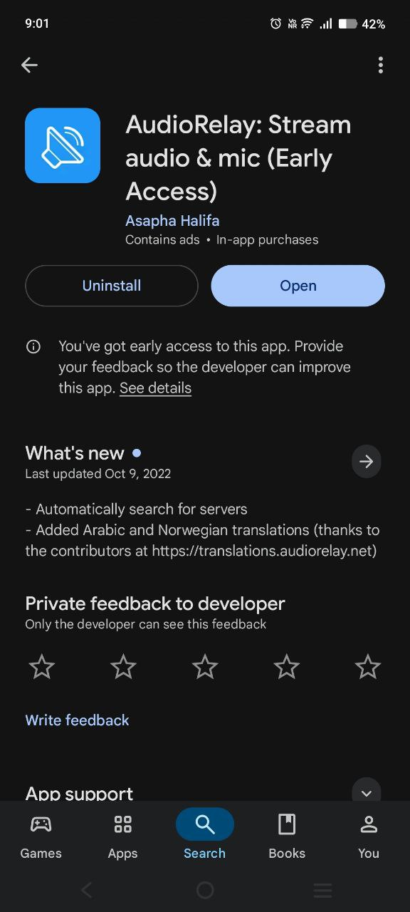
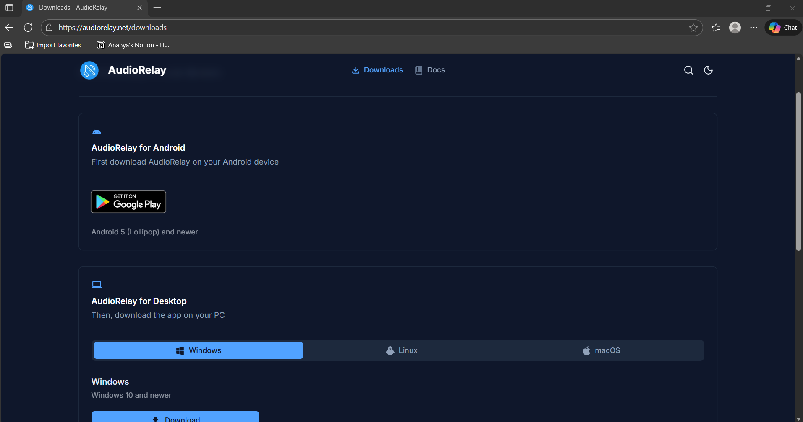
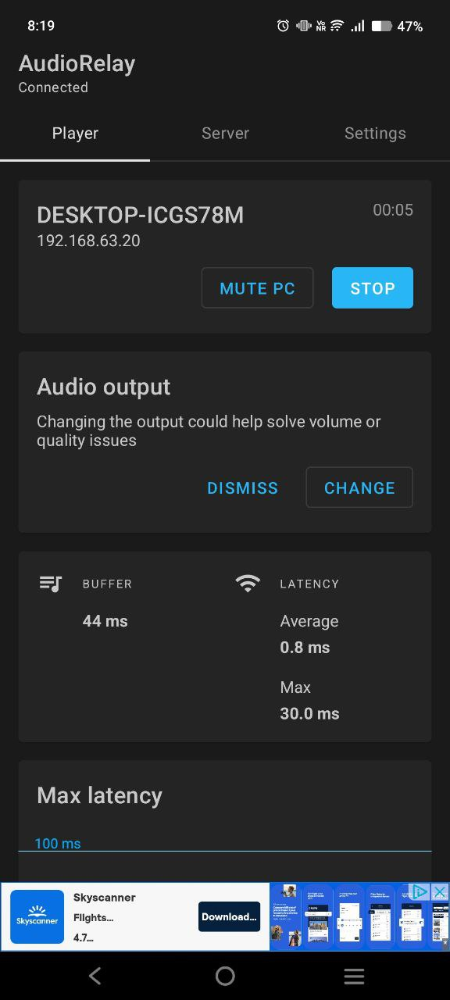

📱🔊 How to Stream PC Audio to Your Phone Using AudioRelay

Follow these simple steps to relay your computer's audio directly to your mobile phone using AudioRelay.

1️⃣ Connect PC & Phone to the Same Network

Make sure your phone and computer are connected to the same Wi-Fi network (example: your Home Wi-Fi).

2️⃣ Install AudioRelay on Your Mobile Phone

Download and install the AudioRelay app from the Play Store.

3️⃣ Install AudioRelay on Your PC (Windows/Mac/Linux)

Download AudioRelay for your computer from the official website and install it.

4️⃣ Open AudioRelay on Both Devices & Connect

Open the app on your mobile 

Open the app on your PC

The phone should automatically detect your PC if both are on the same network. Tap Connect.

5️⃣ Play Audio on Your PC

Once connected, play any audio or video on your laptop —
🎧 You will hear the sound directly from your phone!
